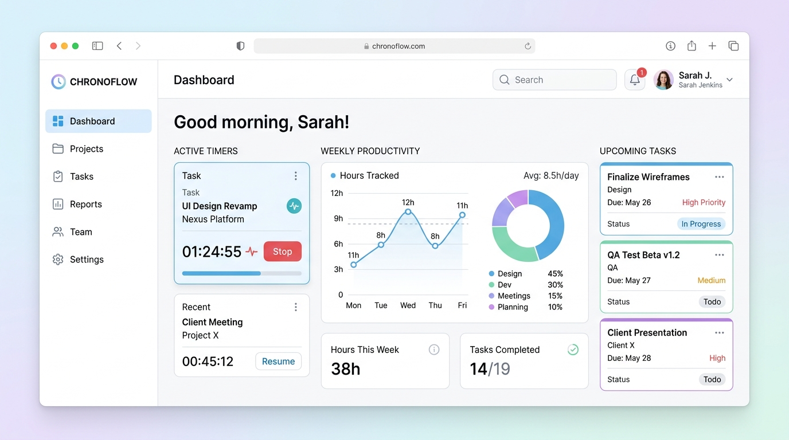

# EndlessTime - Zaman ve Görev Takip Sistemi

EndlessTime, projelerdeki çalışma sürelerini kaydetmek, görevleri yönetmek ve üretkenliği artırmak amacıyla geliştirilmiş çok katmanlı bir web uygulamasıdır.

## 🚀 Kullanılan Teknolojiler
* **Mimari:** ASP.NET Core MVC (Çok Katmanlı Mimari)
* **Katmanlar:**
  * `EndlessTime` (Arayüz ve Denetleyici Katmanı)
  * `EndlessTime.Data` (Veri Erişim ve Repository Katmanı)
  * `EndlessTime.Model` (Varlık ve Veri Modelleri Katmanı)
* **Tasarım:** HTML, CSS, JavaScript, Bootstrap, Areas (Admin/User ayrımı)

## ✨ Özellikler / Yapı
* Çok katmanlı mimari (N-Tier Architecture) yapısı ile sürdürülebilir kod tabanı.
* Admin ve Kullanıcı rolleri için `Areas` modülü ile ayrılmış kontrol panelleri.
* Görev atama, zaman çizelgesi (timesheet) kaydetme ve çalışma raporları.

## 🛠️ Nasıl Çalıştırılır?
1. `appsettings.json` dosyasından veritabanı bağlantı dizesini güncelleyin.
2. EF Core Migrations veya SQL Script yardımıyla veritabanını oluşturun.
3. Projeyi çalıştırıp tarayıcıdan test edin.
